# Activité Pratique N°2 - Développement d'un Micro-service

## Introduction

Dans le cadre de cette activité pratique, nous avons pour objectif de développer un micro-service Spring Boot permettant de gérer des comptes bancaires. Ce travail s’inscrit dans l’apprentissage des architectures microservices, largement utilisées dans le développement d’applications modernes et distribuées.

L’application repose sur les technologies Spring Boot, Spring Data JPA, H2 Database, et Lombok, afin d’assurer une gestion efficace des données et une structure de code simplifiée. Elle met en œuvre une approche complète du développement d’un microservice, depuis la création de l’entité JPA et du dépôt de données jusqu’à l’exposition d’API RESTful documentées avec Swagger et d’un service GraphQL.

Cette activité permet ainsi de comprendre les étapes clés de la mise en place d’un microservice : la conception du modèle de données, l’implémentation de la couche d’accès aux données, la création des services métier et la publication d’interfaces de communication modernes (REST et GraphQL). Le tout sera testé à l’aide d’outils tels que Postman pour la vérification des endpoints et Swagger UI pour la documentation dynamique des API.

---

## I. Créer un projet Spring Boot avec les dépendances Web, Spring Data JPA, H2, Lombok

La première étape consiste à créer un **projet Spring Boot** en utilisant **Spring Initializr**. Lors de la configuration du projet, nous avons ajouté les dépendances suivantes :

- **Spring Web** pour le développement d’API REST,
- **Spring Data JPA** pour l’accès et la manipulation des données,
- **H2 Database** pour disposer d’une base de données embarquée en mémoire et faciliter les tests,
- **Lombok** pour simplifier le code en générant automatiquement les getters, setters et constructeurs.

Cette configuration initiale permet de disposer d’une base solide pour le développement du microservice et d’assurer une intégration fluide entre les différentes couches de l’application.

## II. Créer l'entité JPA Compte

Dans cette étape, nous avons créé la classe **`BankAccount`**, qui représente l’entité principale du microservice. Elle correspond à un **compte bancaire** et sera directement mappée à une table de la base de données grâce à **JPA (Java Persistence API)**.

Le fichier source de cette classe se trouve dans le répertoire `src/main/java/com/example/bankaccountservice/entities/BankAccount.java`.

Cette classe est annotée avec `@Entity` pour indiquer qu’il s’agit d’une entité JPA, et utilise **Lombok** pour réduire le code boilerplate grâce aux annotations `@Data`, `@NoArgsConstructor`, `@AllArgsConstructor` et `@Builder`.


Cette entité contient les principaux attributs d’un compte bancaire : **identifiant**, **date de création**, **solde**, **devise** et **type de compte** (courant ou épargne). Grâce à cette structure, elle servira de base à toutes les opérations de gestion des comptes dans le microservice.


## III. Créer l'interface CompteRepository basée sur Spring Data

Après avoir défini l’entité `BankAccount`, nous avons créé l’interface **`BankAccountRepository`**, qui représente la **couche d’accès aux données (DAO)** du microservice. Cette interface hérite de **`JpaRepository`**, ce qui permet de bénéficier automatiquement de toutes les méthodes CRUD (Create, Read, Update, Delete) sans avoir à les implémenter manuellement.

Le fichier est situé dans le répertoire `src/main/java/com/example/bankaccountservice/repositories/BankAccountRepository.java`

En étendant `JpaRepository<BankAccount, String>`, cette interface indique que le type d’entité géré est **`BankAccount`** et que son identifiant est de type **`String`**. Grâce à Spring Data JPA, cette couche DAO offre un accès simplifié et rapide à la base de données, tout en garantissant une abstraction du code SQL.

## IV. Tester la couche DAO

Afin de vérifier le bon fonctionnement de la couche d’accès aux données (**DAO**), nous avons implémenté un test simple dans la classe principale de l’application : **`BankAccountServiceApplication`**.
Ce test utilise un **`CommandLineRunner`**, qui s’exécute automatiquement au démarrage de l’application pour insérer plusieurs enregistrements dans la base de données **H2** en mémoire.

Concrètement, la méthode `start()` injecte le **`BankAccountRepository`**, puis crée plusieurs objets `BankAccount` avec des valeurs générées aléatoirement (identifiant unique, solde, type de compte, etc.) avant de les enregistrer dans la base via la méthode `save()`.

La configuration de la base de données est définie dans le fichier `application.properties` :

```
spring.datasource.url=jdbc:h2:mem:account-db
spring.h2.console.enabled=true
server.port=8081
```

L’utilisation de **H2** (base de données en mémoire) simplifie le test, car elle ne nécessite aucune installation ni configuration externe. De plus, la console H2, accessible via `http://localhost:8081/h2-console`, permet de visualiser les enregistrements créés.

Pour se connecter à la base entrer l'url `https//localhost:8081/h2-console` dans un navigateur. Dans le formulaire login entrer l'url donné à base de données dans `application.properties` :


Après la connexion cliquer sur la table `BANK_ACCOUNT` puis `run` pour voir les dinnées générées :


Ainsi, cette étape confirme que la couche DAO fonctionne correctement et que la persistance des données via **Spring Data JPA** est pleinement opérationnelle.

## V. Créer le Web service Restfull qui permet de gérer des comptes

Après avoir validé la couche d’accès aux données, nous avons développé un **Web Service RESTful** pour exposer les fonctionnalités de gestion des comptes bancaires via des **API HTTP**.
Pour cela, une classe contrôleur appelée **`AccountRestController`** a été créée dans le répertoire `src/main/java/com/example/bankaccountservice/web`

Cette classe, annotée avec `@RestController`, joue le rôle d’intermédiaire entre le client et la couche de persistance. Elle utilise le **`BankAccountRepository`** pour exécuter les opérations CRUD (Create, Read, Update, Delete) sur les comptes bancaires.

Les principaux endpoints mis en place sont :

* `GET /bankAccounts` → pour récupérer la liste de tous les comptes,
* `GET /bankAccounts/{id}` → pour consulter un compte spécifique,
* `POST /bankAccounts` → pour créer un nouveau compte,
* `PUT /bankAccounts/{id}` → pour modifier un compte existant,
* `DELETE /bankAccounts/{id}` → pour supprimer un compte.

Chaque méthode du contrôleur repose sur les annotations **Spring Web** (`@GetMapping`, `@PostMapping`, `@PutMapping`, `@DeleteMapping`), qui simplifient la création des routes et la gestion des requêtes HTTP.

Ainsi, ce Web Service RESTful constitue le cœur fonctionnel du microservice, permettant d’interagir avec les comptes bancaires à travers des appels API standard, tout en assurant une séparation claire entre la logique métier et la présentation des données.

## VI. Tester le web micro-service en utilisant un client REST comme Postman

Une fois le Web Service RESTful mis en place, nous avons procédé à une phase de **tests pratiques** à l’aide de l’outil **Postman**, afin de vérifier le bon fonctionnement des différentes routes exposées par le microservice.

Les tests ont porté sur les principales opérations CRUD suivantes :

* **GET** → Pour récupérer la liste de tous les comptes bancaires, nous avons utilisé l’URL :

  ```
  http://localhost:8081/bankAccounts
  ```

  Cette requête retourne au format JSON la liste complète des comptes enregistrés dans la base H2.


On peut aussi récupérer un compte bancaire en entrant son id dans l'url comme suit :

  ```
  http://localhost:8081/bankAccounts/{id}
  ```


* **POST** → Pour créer un nouveau compte, nous avons utilisé la même URL :

  ```
  http://localhost:8081/bankAccounts
  ```

  En ajoutant dans les en-têtes (**Headers**) :

  ```
  Content-Type: application/json
  ```

  et en envoyant dans le corps (**Body**) un contenu JSON brut (**raw JSON**) contenant les informations du compte à créer (balance, currency, type, etc.).


* **PUT** → Pour mettre à jour un compte existant, nous avons envoyé une requête vers :

  ```
  http://localhost:8081/bankAccounts/{id}
  ```

  où `{id}` correspond à l’identifiant du compte précédemment créé.
  Le corps de la requête contient un nouveau JSON modifié, permettant de changer certaines valeurs comme le solde ou la devise.


Ces tests ont permis de confirmer le bon comportement du microservice, la persistance des données dans la base H2 et la cohérence des réponses JSON retournées par l’API.

## VII. Générer et tester la documentation Swagger des API Rest du Web service

Afin de documenter et de tester facilement les différentes routes du microservice, nous avons intégré **Swagger** à notre projet à l’aide de la bibliothèque **Springdoc OpenAPI**.

Pour cela, nous avons ajouté la dépendance suivante dans le fichier `pom.xml`, récupérée depuis le dépôt officiel **Maven Repository** :

```xml
<!-- https://mvnrepository.com/artifact/org.springdoc/springdoc-openapi-ui -->
<dependency>
    <groupId>org.springdoc</groupId>
    <artifactId>springdoc-openapi-starter-webmvc-ui</artifactId>
    <version>2.6.0</version>
</dependency>
```

Une fois la dépendance installée, la documentation interactive est automatiquement générée et accessible via l’URL suivante :

```
http://localhost:8081/swagger-ui/index.html
```

Elle se présente comme suit :


Depuis cette interface Swagger, nous avons pu **visualiser, tester et exécuter directement les requêtes HTTP** sur nos API REST — notamment les méthodes :

* **GET** → récupération de tous les comptes :

  

* **POST** → création d’un nouveau compte :

  

* **GET /{id}** → consultation d’un compte précis :
  

Swagger fournit également une **spécification OpenAPI** au format JSON accessible via :

```
http://localhost:8081/v3/api-docs
```

Ce lien a été **importé dans Postman**, ce qui a permis de générer automatiquement tous les endpoints du microservice et de les tester plus rapidement à partir de l’environnement Postman.

Exemple de test avec la méthode GET :


Cette étape a ainsi facilité la **validation, la documentation et la maintenance** du Web Service REST, tout en offrant une interface claire pour les futurs développeurs et testeurs.

## VIII. Exposer une API Restful en utilisant Spring Data Rest en exploitant des projections 

Dans cette étape, nous avons enrichi notre microservice en exposant automatiquement les entités JPA sous forme d’API RESTful grâce à **Spring Data REST**.
Pour cela, nous avons ajouté la dépendance suivante dans le fichier `pom.xml` :

```xml
<dependency>
    <groupId>org.springframework.boot</groupId>
    <artifactId>spring-boot-starter-data-rest</artifactId>
</dependency>
```

Cette dépendance permet à Spring Boot de générer automatiquement des endpoints REST basés sur les repositories JPA, sans avoir à écrire manuellement de contrôleur pour chaque opération.
Ainsi l'accès aux comptes avec spring data rest se fait de la manière suivante :

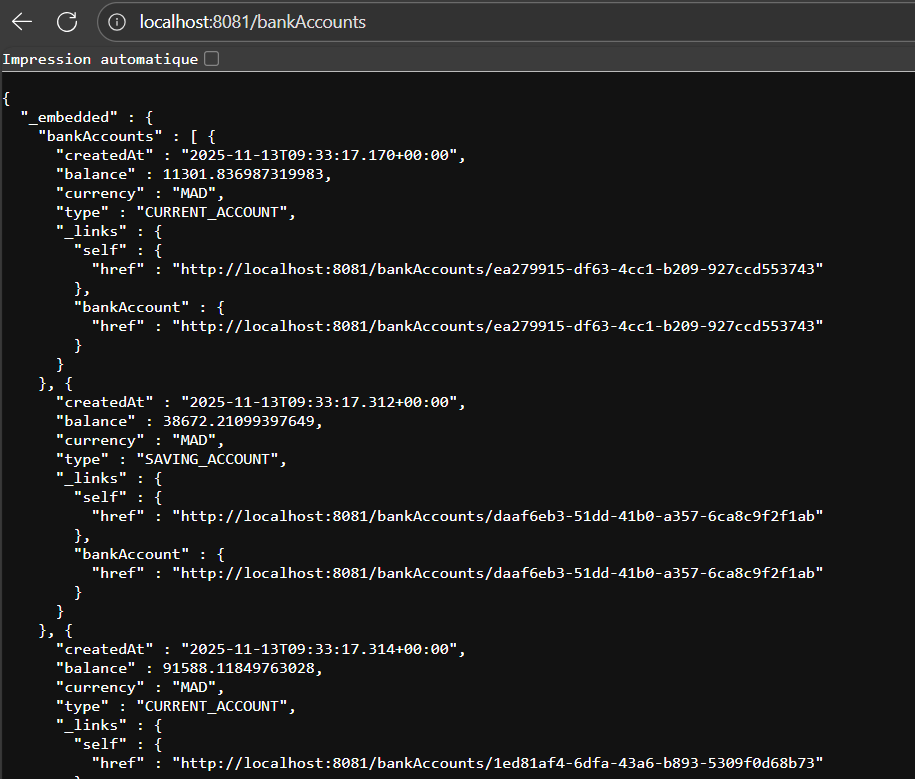

Afin d’organiser les routes, nous avons ajouté l’annotation `@RequestMapping("/api")` dans la classe `AccountRestController`, ce qui place toutes les routes REST du contrôleur sous le préfixe **/api**.

Nous avons ensuite enrichi l’interface `BankAccountRepository` avec une **méthode de recherche personnalisée** permettant de filtrer les comptes par type :

```java
List<BankAccount> findByType(AccountType type);
```

et annoté le repository avec :

```java
@RepositoryRestResource
```

pour exposer directement les ressources via Spring Data REST.
La méthode a également été annotée avec :

```java
@RestResource(path = "/byType")
```

et un alias de paramètre `@Param("t")` a été ajouté pour simplifier les requêtes.

Exemple de recherche par type :

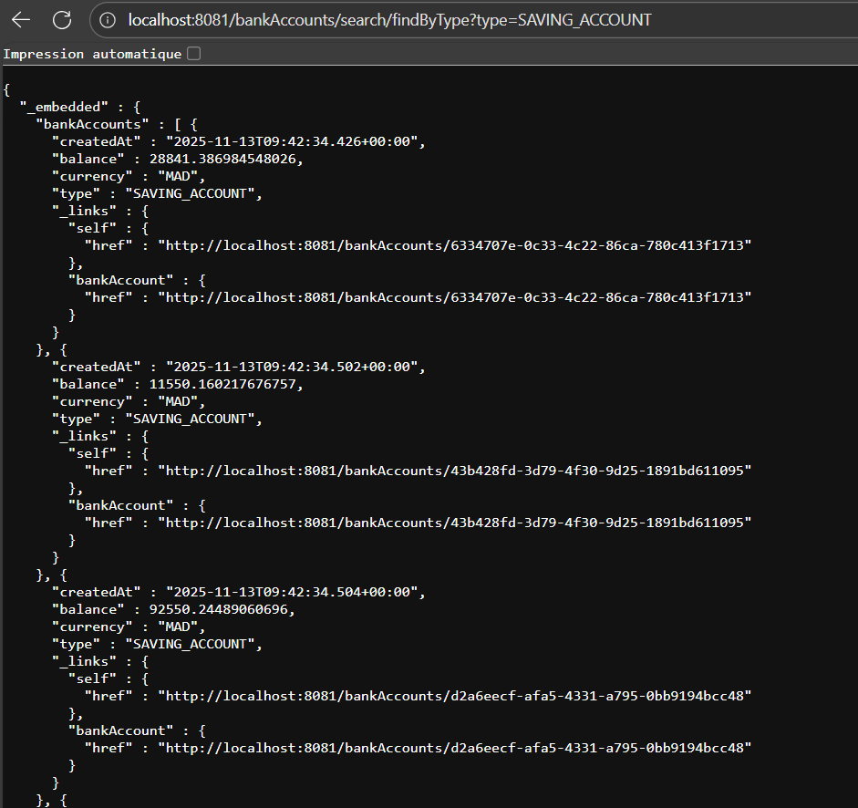

Recherche simplifiée :

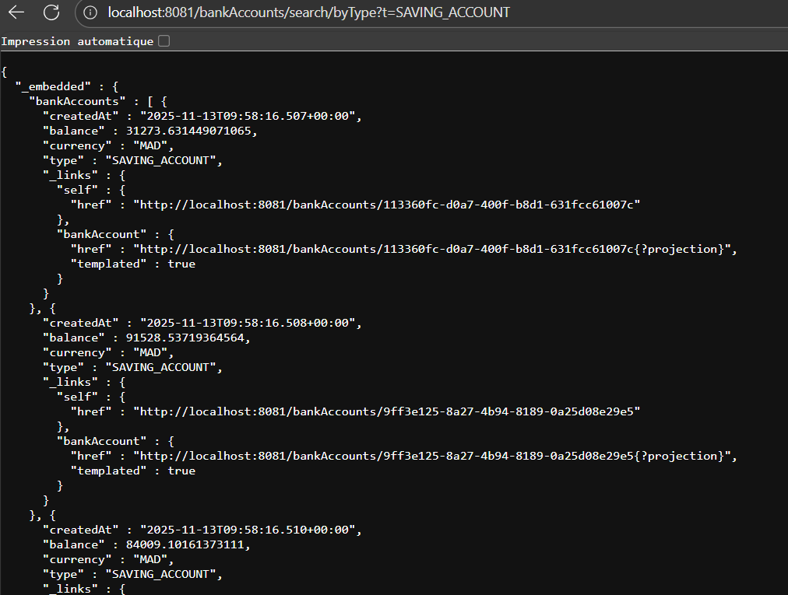

Pour améliorer la visualisation des données, nous avons créé l'interface `AccountProjection` dans le package `entities`, permettant de n’afficher qu’un sous-ensemble des attributs d’un compte (id, type, solde).
Cette projection a été définie ainsi :

```java
@Projection(types = BankAccount.class, name = "p1")
public interface AccountProjection {
    String getId();
    AccountType getType();
    Double getBalance();
}
```

Grâce à cette configuration, il est désormais possible d’interroger les comptes en précisant une projection, par exemple :

```
http://localhost:8081/bankAccounts?projection=p1
```
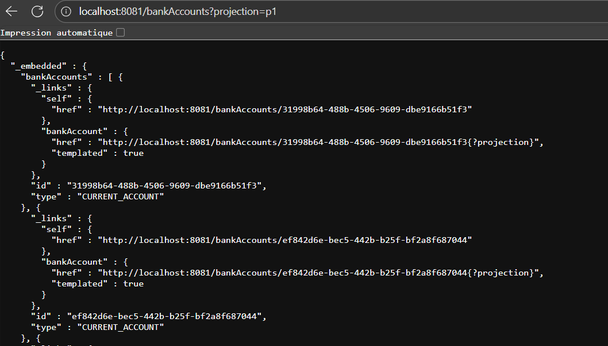

Cette étape montre la puissance de **Spring Data REST**, qui permet d’exposer automatiquement les données tout en conservant la flexibilité des requêtes et la lisibilité des résultats grâce aux projections.

## IX. Créer les DTOs et Mappers

Pour structurer les échanges de données entre le client et le serveur, nous avons introduit une couche **DTO (Data Transfer Objects)**.
L’objectif principal est de **découpler le modèle de données interne** (l’entité `BankAccount`) des objets exposés via les API, afin de respecter les bonnes pratiques d’architecture et de garantir une meilleure maintenabilité.

Dans le package `dto`, deux classes ont été créées :

- `BankAccountRequestDTO` :
Ce DTO représente les données qu’un client envoie lorsqu’il souhaite créer un compte.
Il contient uniquement les attributs nécessaires à la création, ce qui évite d’exposer des champs sensibles ou gérés automatiquement par l’application (comme l’ID ou la date de création).

- `BankAccountResponseDTO` :
Ce DTO est utilisé pour renvoyer la réponse au client.
Il inclut notamment l’identifiant généré, la date de création, ainsi que tous les attributs pertinents du compte.

Pour transformer les entités en DTOs, nous avons créé une classe **`AccountMapper`** dans un package dédié `mappers`.
Ce mapper utilise `BeanUtils.copyProperties()` pour copier automatiquement les valeurs d’une entité vers un DTO de réponse.

Cette approche permet :

* d’éviter du code répétitif,
* de centraliser la logique de transformation,
* de rendre la couche Web totalement indépendante de la structure interne de l’entité.

Les DTOs et le Mapper constituent ensemble la couche nécessaire pour un **échange de données propre, sécurisé et conforme aux bonnes pratiques REST**.

## X. Créer la couche Service (métier) et du micro service

Pour respecter l’architecture en couches, nous avons ajouté une **couche Service**, qui joue le rôle d’intermédiaire entre le contrôleur REST et le repository JPA.
Cette couche contient la logique métier, tandis que le contrôleur se limite au rôle d’interface API.

Nous avons créé le package `service` contenant :

- L’interface `AccountService` :
Elle définit les opérations métiers disponibles.
Pour l’instant, une méthode essentielle a été déclarée :

**addAccount(...)** : créer un nouveau compte à partir d’un `BankAccountRequestDTO` et retourner un `BankAccountResponseDTO`.

- La classe `AccountServiceImpl` :
Elle constitue l’implémentation concrète de l’interface.
On y trouve la logique métier suivante :

  * génération automatique d’un **UUID** pour l’identifiant,
  * initialisation de la date de création,
  * conversion du DTO de requête vers un objet `BankAccount`,
  * persistance du compte via le `BankAccountRepository`,
  * transformation de l’entité sauvegardée en `BankAccountResponseDTO` grâce au `AccountMapper`.

La classe est annotée avec :

* `@Service` → pour être détectée par Spring,
* `@Transactional` → pour garantir la cohérence des opérations en base.

### Mise à jour du contrôleur selon les bonnes pratiques

Dans le `AccountRestController`, la méthode POST a été modifiée pour utiliser la couche service plutôt que d’appeler directement le repository.
Elle reçoit désormais un **BankAccountRequestDTO**, puis délègue la création du compte à `AccountService`.

Cela permet :
* de centraliser la logique métier dans le service,
* d’éviter que le contrôleur manipule directement l’entité,
* de garantir une architecture mieux structurée et extensible.

Le contrôleur injecte maintenant :
* `AccountService`,
* `AccountMapper`.

via un constructeur (meilleure pratique recommandée plutôt que `@Autowired` sur les champs).

### Tests via Swagger

Une fois ces éléments mis en place, nous avons testé la méthode POST directement depuis Swagger, en envoyant un `BankAccountRequestDTO` et en vérifiant que le `BankAccountResponseDTO` retourné contenait bien :

* un ID généré automatiquement,
* une date de création,
* les informations fournies dans la requête.

Exemple de requete :

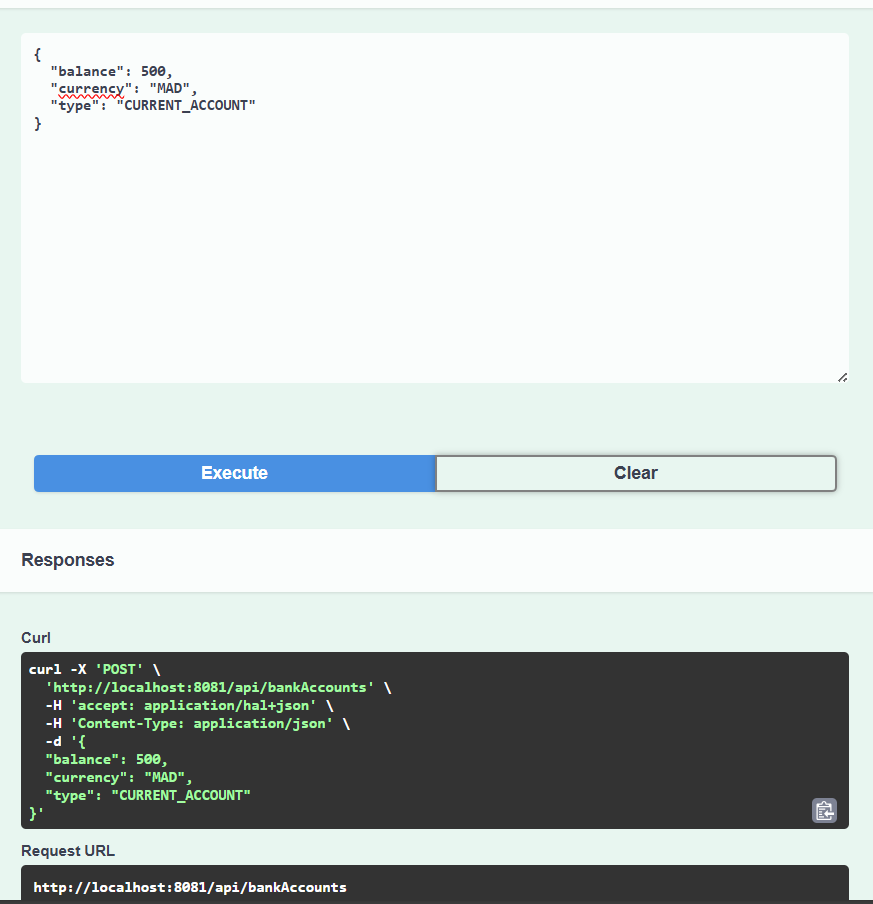

## XI. Créer un Web service GraphQL pour ce Micro-service

### 1. Configuration et test du service GraphQL

Après la définition du schéma GraphQL et la création du contrôleur GraphQL, nous avons configuré le comportement de GraphQL au niveau de l’application via le fichier `application.properties`.

Deux propriétés ont été ajoutées :

* **`spring.graphql.path=/graphql`**
  Cette propriété permet de définir le point d’entrée principal du service GraphQL. Toutes les requêtes GraphQL sont ainsi exposées via l’URL :

  ```
  http://localhost:8081/graphiql
  ```

* **`spring.graphql.graphiql.enabled=true`**
  Cette option permet d’activer **GraphiQL**, une interface web interactive permettant de tester les requêtes GraphQL directement depuis le navigateur.


### Problème rencontré et solution adoptée

Lors des tests, un **problème d’affichage et de chargement de l’interface GraphiQL dans le navigateur** a été rencontré, empêchant l’exécution correcte des requêtes GraphQL via cette interface.

Afin de contourner ce problème et de poursuivre les tests, nous avons utilisé **Altair GraphQL Client**, un outil dédié aux requêtes GraphQL.
Altair offre une interface stable et intuitive pour exécuter et tester les requêtes GraphQL.

Toutes les requêtes ont alors été effectuées en utilisant l’URL suivante :

```
http://localhost:8081/graphql
```

Grâce à Altair, nous avons pu :

* exécuter la requête `accountsList`,
* visualiser les données retournées,
* vérifier la bonne communication entre le schéma GraphQL, le contrôleur et la base de données.

Voici le query pour voir tous les compte :
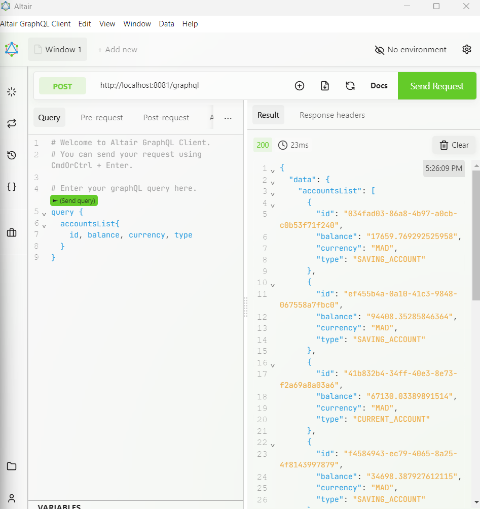

Voici le query pour voir un seul à partir de son id :


### 2. Gestion des erreurs dans le Web Service GraphQL

Dans cette partie, nous avons mis en place une **gestion personnalisée des erreurs GraphQL**, afin de mieux contrôler les messages retournés au client en cas d’exception lors de l’exécution des requêtes.

Pour cela, nous avons créé un package dédié **`exceptions`**, contenant la classe **`CustomDataFetcherExceptionResolver`**.
Cette classe étend `DataFetcherExceptionResolverAdapter`, un mécanisme fourni par **Spring GraphQL** permettant d’intercepter les exceptions levées pendant l’exécution des requêtes GraphQL.

La classe est annotée avec `@Component`, ce qui permet à Spring de la détecter automatiquement et de l’utiliser comme **résolveur global des erreurs GraphQL**.

### Rôle du `CustomDataFetcherExceptionResolver`

Cette implémentation permet :

* de capturer toute exception levée dans les méthodes GraphQL (`@QueryMapping`, `@MutationMapping`),
* de transformer l’exception Java en une **erreur GraphQL compréhensible côté client**,
* de retourner un message clair et contrôlé via la méthode `getMessage()`.

Ainsi, au lieu d’obtenir une erreur technique complexe ou une stack trace, le client reçoit une réponse GraphQL structurée contenant uniquement le message d’erreur pertinent.

### Avantages de cette approche

Cette gestion personnalisée des erreurs permet :

* une **meilleure lisibilité des erreurs côté client**,
* une **séparation claire entre la logique métier et la gestion des exceptions**,
* une **sécurité renforcée**, en évitant d’exposer des détails internes de l’application.

Grâce à cette configuration, le service GraphQL devient plus robuste et plus adapté à une utilisation en production, tout en offrant une expérience de test plus claire lors de l’utilisation d’outils comme **Altair**.

Avant la gestion des erreurs nous avions cette sortie lors d'une erreur :
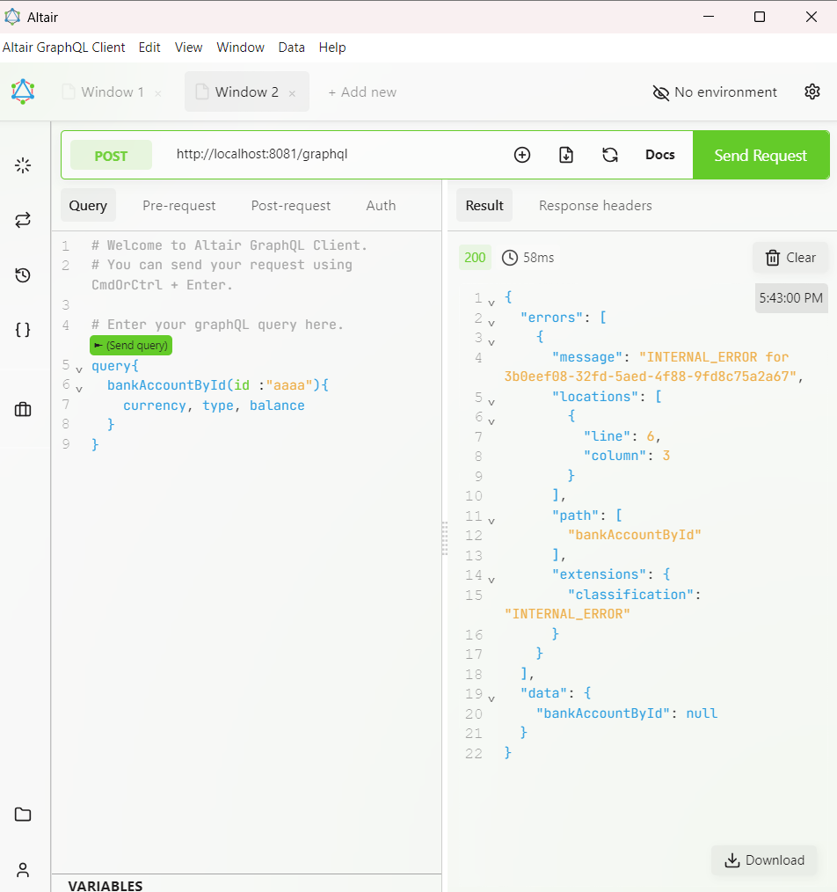

Après la gestion des erreurs voici :
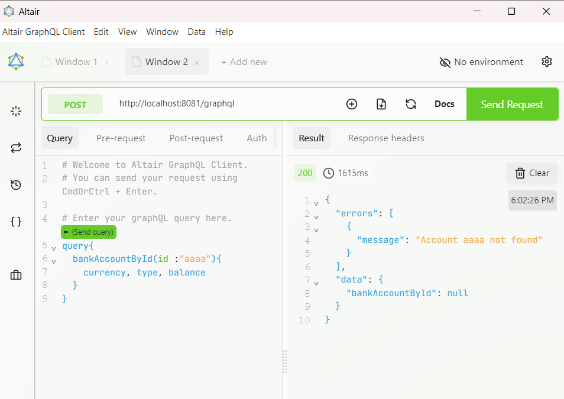

### 3. Ajout des mutations GraphQL (création, mise à jour et suppression)

Dans cette partie, nous avons enrichi le Web Service GraphQL en ajoutant des **mutations**, permettant d’effectuer des opérations de **création, modification et suppression** des comptes bancaires.
Contrairement aux requêtes (**Query**), les mutations sont utilisées pour modifier l’état des données.

### Évolution du contrôleur GraphQL

La classe **`BankAccountGraphQLController`** a été étendue afin de gérer à la fois :

* des **requêtes GraphQL** (`@QueryMapping`),
* des **mutations GraphQL** (`@MutationMapping`).

Deux types de requêtes sont désormais disponibles :

* récupération de la liste des comptes,
* récupération d’un compte spécifique par son identifiant.

Pour les mutations :

* **ajout d’un compte** : délégation à la couche service (`AccountService`) afin de respecter l’architecture métier,
* **mise à jour d’un compte** : passage de l’identifiant et des nouvelles données à la couche service,
* **suppression d’un compte** : suppression directe via le repository.

L’injection de `AccountService` dans le contrôleur permet de réutiliser la logique métier déjà implémentée pour les API REST, garantissant ainsi une cohérence entre les interfaces REST et GraphQL.

### Mise à jour du schéma GraphQL

Le fichier `schema.graphqls` a été mis à jour afin d’intégrer :

* des **requêtes paramétrées** (`bankAccountById`),
* un type **Mutation** pour gérer les opérations CRUD,
* un type **input** (`BankAccountDTO`) utilisé pour transmettre les données lors des mutations.

L’utilisation d’un type `input` permet de :

* structurer les données envoyées par le client,
* éviter l’exposition directe de l’entité,
* rester cohérent avec l’approche DTO utilisée côté REST.

### Résultat obtenu

Grâce à cette configuration, le microservice permet désormais via GraphQL :

* de consulter tous les comptes ou un compte précis,
* d’ajouter un nouveau compte :
  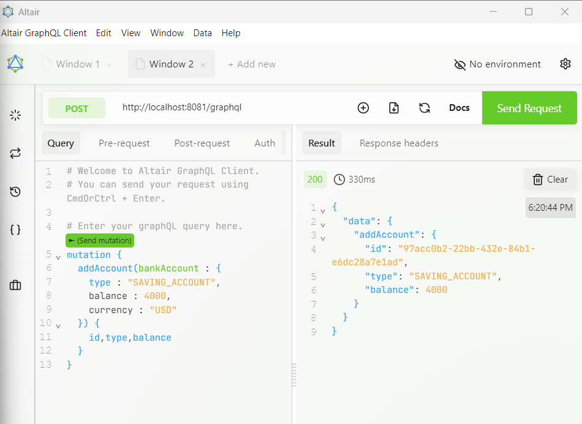

  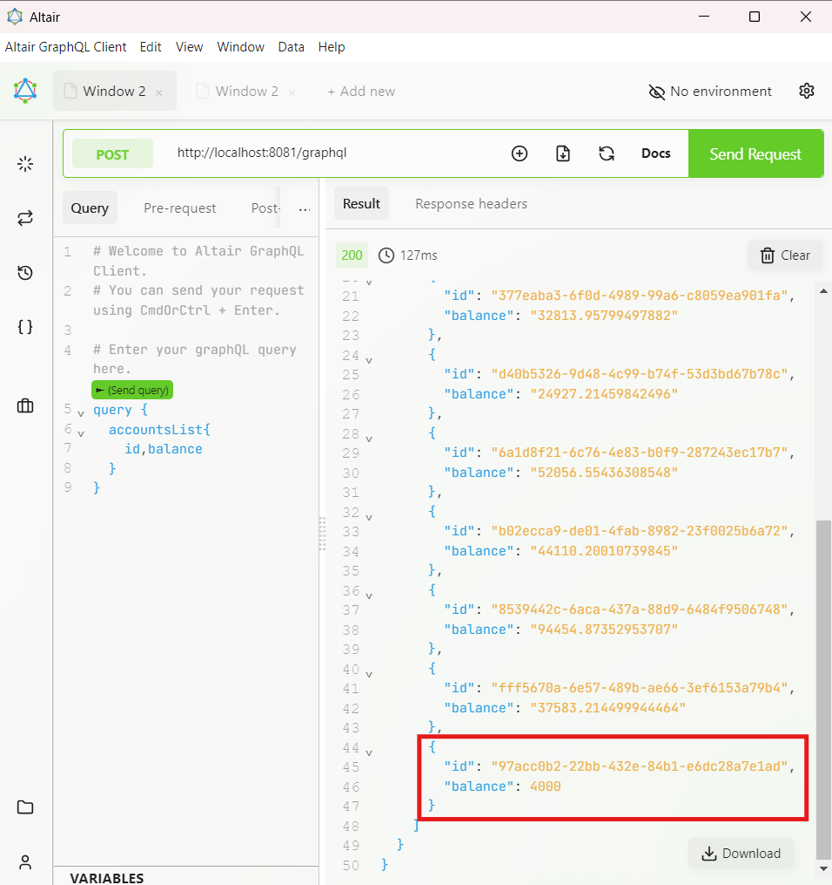

* de mettre à jour un compte existant :
  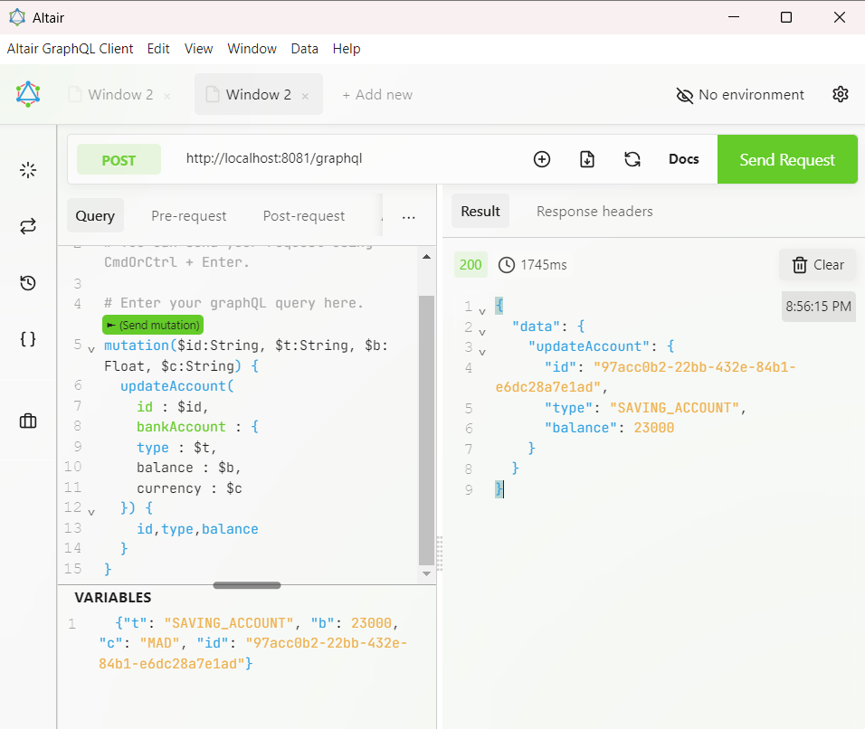

* de supprimer un compte :
  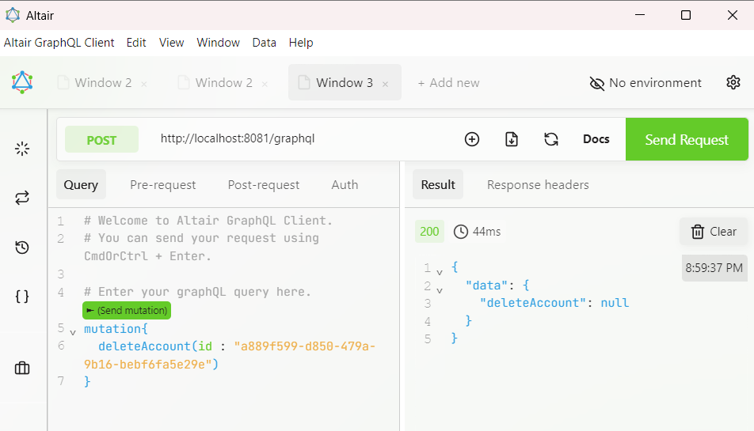


Toutes ces opérations ont été testées avec succès à l’aide du client **Altair**, en interrogeant l’endpoint :

```
http://localhost:8081/graphql
```

Cette dernière étape complète l’implémentation du Web Service GraphQL et démontre la capacité du microservice à proposer des **interfaces REST et GraphQL complémentaires**, répondant aux standards modernes de développement.

### 4. Ajout de l’entité `Customer` et gestion de la relation avec `BankAccount`

Dans cette dernière partie, nous avons enrichi le microservice en introduisant une nouvelle entité **`Customer`**, représentant le propriétaire des comptes bancaires.
Cette évolution permet de modéliser une relation réelle du domaine bancaire : **un client peut posséder plusieurs comptes**, tandis qu’un compte appartient à un seul client.

### Création de l’entité `Customer`

Une nouvelle classe **`Customer`** a été créée dans le package `entities`.
Cette entité est définie comme une entité JPA et contient :

* un identifiant généré automatiquement,
* le nom du client,
* une relation **OneToMany** avec l’entité `BankAccount`.

L’attribut `bankAccounts` est annoté avec `@JsonProperty(access = WRITE_ONLY)` afin d’éviter les problèmes de sérialisation circulaire lors des échanges REST ou GraphQL.

### Mise à jour de l’entité `BankAccount`

L’entité `BankAccount` a été modifiée pour intégrer :

* une relation **ManyToOne** vers l’entité `Customer`,
* une annotation `@Enumerated(EnumType.STRING)` pour stocker le type de compte sous forme lisible en base de données.

Cette configuration établit une relation bidirectionnelle entre les clients et leurs comptes, conforme aux bonnes pratiques JPA.

### Initialisation des données au démarrage

Le fichier principal de l’application a été mis à jour afin d’initialiser automatiquement :

* une liste de clients,
* plusieurs comptes bancaires associés à chaque client.

Cette initialisation est réalisée via un `CommandLineRunner`, ce qui permet de disposer immédiatement de données exploitables au démarrage de l’application.
Les données ont ensuite été **vérifiées à l’aide de la console H2**, confirmant la bonne création des relations entre les tables `Customer` et `BankAccount`.
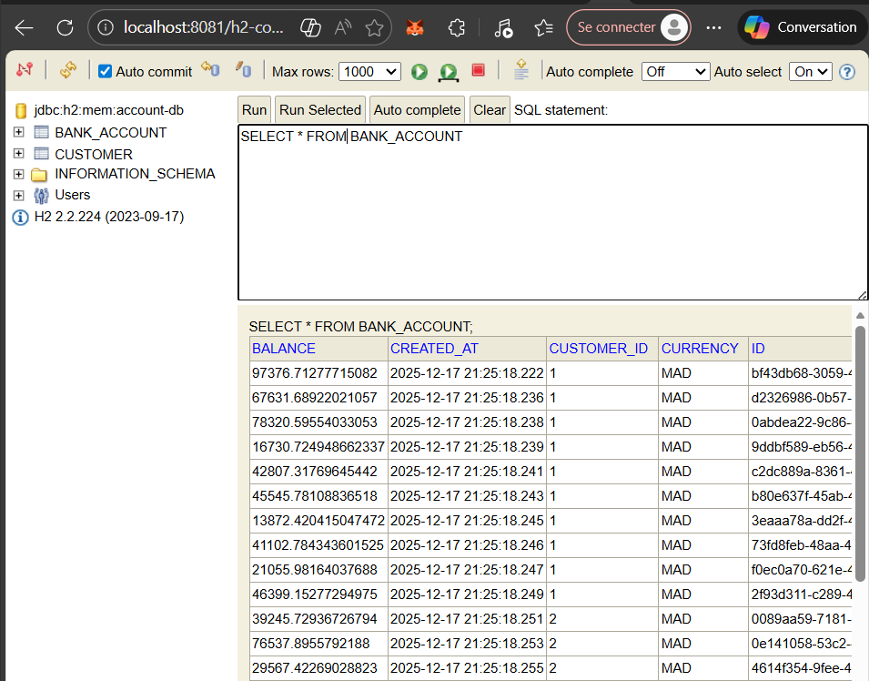

### Extension du schéma GraphQL

Le schéma GraphQL a été enrichi pour prendre en charge la nouvelle entité `Customer`.
Les modifications incluent :

* l’ajout d’une requête `customers` pour récupérer la liste des clients,
* l’ajout du type `Customer`,
* l’intégration de la relation entre `Customer` et `BankAccount`.

Grâce à GraphQL, il est désormais possible de :

* récupérer la liste des comptes avec leurs propriétaires,
* récupérer la liste des clients avec l’ensemble de leurs comptes bancaires.

### Mise à jour du contrôleur GraphQL

Une nouvelle méthode a été ajoutée dans le contrôleur GraphQL pour exposer la requête `customers`.
Cette méthode s’appuie sur le repository des clients pour retourner la liste complète des clients enregistrés.

### Tests avec Altair

Les différentes requêtes GraphQL ont été testées avec succès à l’aide du client **Altair**.
Ces tests ont permis de vérifier :

* la récupération des comptes bancaires avec les informations du client associé :
  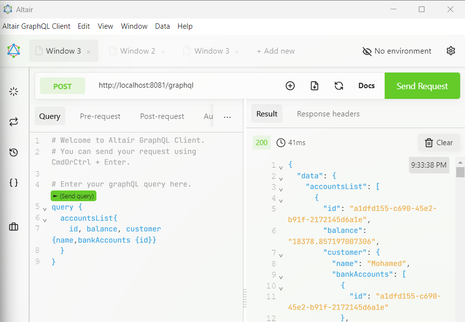

* la récupération des clients avec l’ensemble de leurs comptes :
  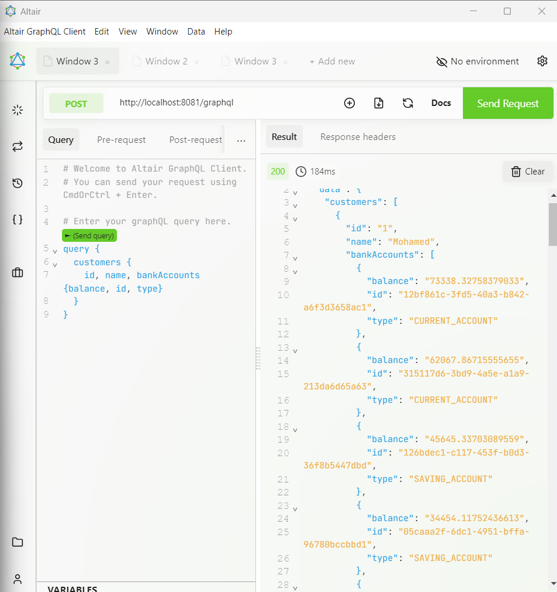

* le bon fonctionnement des relations entre les entités.

L’ajout de l’entité `Customer` permet de rendre le microservice plus réaliste et plus complet.
Cette étape démontre :

* la maîtrise des **relations JPA**,
* l’intégration fluide entre **REST, GraphQL et la couche métier**,
* la puissance de **GraphQL** pour naviguer efficacement entre des données liées.

---

## Conclusion

Cette activité pratique a permis de mettre en œuvre de manière progressive et concrète le **développement d’un microservice bancaire** basé sur **Spring Boot**, en respectant les principes des **architectures modernes et distribuées**.

Tout au long de ce travail, nous avons abordé l’ensemble des couches essentielles d’un microservice : la modélisation des entités JPA, la persistance des données avec **Spring Data JPA**, l’exposition d’API **RESTful**, leur documentation avec **Swagger/OpenAPI**, ainsi que l’implémentation d’une **API GraphQL** complète intégrant requêtes, mutations et gestion personnalisée des erreurs.

L’introduction des **DTOs, Mappers et de la couche Service** a permis de respecter les bonnes pratiques d’architecture logicielle en assurant une séparation claire des responsabilités entre les couches Web, Métier et Données. De plus, l’ajout de l’entité **Customer** et la gestion des relations entre les entités ont renforcé le réalisme du domaine métier et démontré la maîtrise des relations JPA et de leur exposition via GraphQL.

Les différents tests réalisés à l’aide de **Postman**, **Swagger UI**, **Altair** et de la **console H2** ont permis de valider le bon fonctionnement du microservice et de ses différentes interfaces. Cette activité a ainsi permis de comparer et de comprendre les avantages des approches **REST** et **GraphQL** dans un contexte réel.

En conclusion, cette activité pratique constitue une base solide pour la compréhension et la mise en œuvre de microservices Spring Boot professionnels, évolutifs et bien structurés, et prépare efficacement aux projets plus complexes en architectures distribuées et orientées services.

---

## Réalisé par :
- **Nom :** Wendbénédo Albéric Darius KONSEBO
- **Module :** Systèmes Distribués et Parallèles
- **Encadré par :** Pr. Mohamed YOUSSFI
- **Année académique :** 2025 - 2026