# Activité Pratique N°2 - Développement d'un Micro-service

## Introduction

Dans le cadre de cette activité pratique, nous avons pour objectif de développer un micro-service Spring Boot permettant de gérer des comptes bancaires. Ce travail s’inscrit dans l’apprentissage des architectures microservices, largement utilisées dans le développement d’applications modernes et distribuées.

L’application repose sur les technologies Spring Boot, Spring Data JPA, H2 Database, et Lombok, afin d’assurer une gestion efficace des données et une structure de code simplifiée. Elle met en œuvre une approche complète du développement d’un microservice, depuis la création de l’entité JPA et du dépôt de données jusqu’à l’exposition d’API RESTful documentées avec Swagger et d’un service GraphQL.

Cette activité permet ainsi de comprendre les étapes clés de la mise en place d’un microservice : la conception du modèle de données, l’implémentation de la couche d’accès aux données, la création des services métier et la publication d’interfaces de communication modernes (REST et GraphQL). Le tout sera testé à l’aide d’outils tels que Postman pour la vérification des endpoints et Swagger UI pour la documentation dynamique des API.

---

## I. Créer un projet Spring Boot avec les dépendances Web, Spring Data JPA, H2, Lombok

La première étape consiste à créer un **projet Spring Boot** en utilisant **Spring Initializr**. Lors de la configuration du projet, nous avons ajouté les dépendances suivantes :

- **Spring Web** pour le développement d’API REST,
- **Spring Data JPA** pour l’accès et la manipulation des données,
- **H2 Database** pour disposer d’une base de données embarquée en mémoire et faciliter les tests,
- **Lombok** pour simplifier le code en générant automatiquement les getters, setters et constructeurs.

Cette configuration initiale permet de disposer d’une base solide pour le développement du microservice et d’assurer une intégration fluide entre les différentes couches de l’application.

## II. Créer l'entité JPA Compte

Dans cette étape, nous avons créé la classe **`BankAccount`**, qui représente l’entité principale du microservice. Elle correspond à un **compte bancaire** et sera directement mappée à une table de la base de données grâce à **JPA (Java Persistence API)**.

Le fichier source de cette classe se trouve dans le répertoire `src/main/java/com/example/bankaccountservice/entities/BankAccount.java`.

Cette classe est annotée avec `@Entity` pour indiquer qu’il s’agit d’une entité JPA, et utilise **Lombok** pour réduire le code boilerplate grâce aux annotations `@Data`, `@NoArgsConstructor`, `@AllArgsConstructor` et `@Builder`.


Cette entité contient les principaux attributs d’un compte bancaire : **identifiant**, **date de création**, **solde**, **devise** et **type de compte** (courant ou épargne). Grâce à cette structure, elle servira de base à toutes les opérations de gestion des comptes dans le microservice.


## III. Créer l'interface CompteRepository basée sur Spring Data

Après avoir défini l’entité `BankAccount`, nous avons créé l’interface **`BankAccountRepository`**, qui représente la **couche d’accès aux données (DAO)** du microservice. Cette interface hérite de **`JpaRepository`**, ce qui permet de bénéficier automatiquement de toutes les méthodes CRUD (Create, Read, Update, Delete) sans avoir à les implémenter manuellement.

Le fichier est situé dans le répertoire `src/main/java/com/example/bankaccountservice/repositories/BankAccountRepository.java`

En étendant `JpaRepository<BankAccount, String>`, cette interface indique que le type d’entité géré est **`BankAccount`** et que son identifiant est de type **`String`**. Grâce à Spring Data JPA, cette couche DAO offre un accès simplifié et rapide à la base de données, tout en garantissant une abstraction du code SQL.

## IV. Tester la couche DAO

Afin de vérifier le bon fonctionnement de la couche d’accès aux données (**DAO**), nous avons implémenté un test simple dans la classe principale de l’application : **`BankAccountServiceApplication`**.
Ce test utilise un **`CommandLineRunner`**, qui s’exécute automatiquement au démarrage de l’application pour insérer plusieurs enregistrements dans la base de données **H2** en mémoire.

Concrètement, la méthode `start()` injecte le **`BankAccountRepository`**, puis crée plusieurs objets `BankAccount` avec des valeurs générées aléatoirement (identifiant unique, solde, type de compte, etc.) avant de les enregistrer dans la base via la méthode `save()`.

La configuration de la base de données est définie dans le fichier `application.properties` :

```
spring.datasource.url=jdbc:h2:mem:account-db
spring.h2.console.enabled=true
server.port=8081
```

L’utilisation de **H2** (base de données en mémoire) simplifie le test, car elle ne nécessite aucune installation ni configuration externe. De plus, la console H2, accessible via `http://localhost:8081/h2-console`, permet de visualiser les enregistrements créés.

Pour se connecter à la base entrer l'url `https//localhost:8081/h2-console` dans un navigateur. Dans le formulaire login entrer l'url donné à base de données dans `application.properties` :

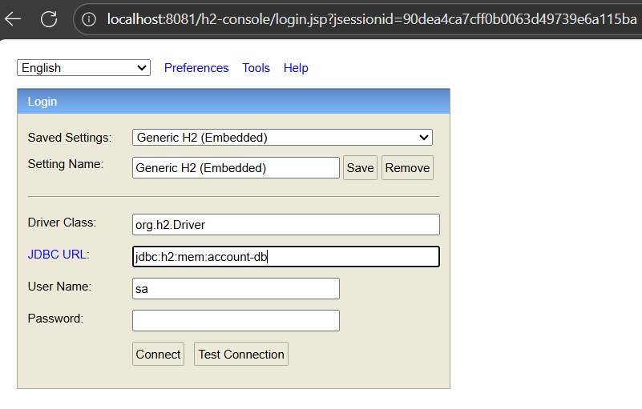

Après la connexion cliquer sur la table `BANK_ACCOUNT` puis `run` pour voir les dinnées générées :

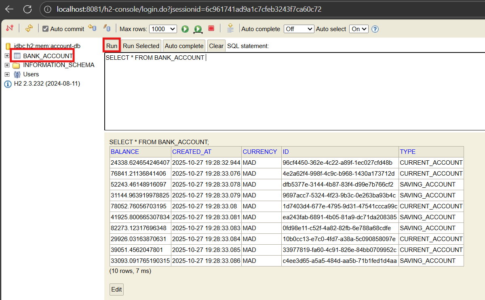

Ainsi, cette étape confirme que la couche DAO fonctionne correctement et que la persistance des données via **Spring Data JPA** est pleinement opérationnelle.

## V. Créer le Web service Restfull qui permet de gérer des comptes

Après avoir validé la couche d’accès aux données, nous avons développé un **Web Service RESTful** pour exposer les fonctionnalités de gestion des comptes bancaires via des **API HTTP**.
Pour cela, une classe contrôleur appelée **`AccountRestController`** a été créée dans le répertoire `src/main/java/com/example/bankaccountservice/web`

Cette classe, annotée avec `@RestController`, joue le rôle d’intermédiaire entre le client et la couche de persistance. Elle utilise le **`BankAccountRepository`** pour exécuter les opérations CRUD (Create, Read, Update, Delete) sur les comptes bancaires.

Les principaux endpoints mis en place sont :

* `GET /bankAccounts` → pour récupérer la liste de tous les comptes,
* `GET /bankAccounts/{id}` → pour consulter un compte spécifique,
* `POST /bankAccounts` → pour créer un nouveau compte,
* `PUT /bankAccounts/{id}` → pour modifier un compte existant,
* `DELETE /bankAccounts/{id}` → pour supprimer un compte.

Chaque méthode du contrôleur repose sur les annotations **Spring Web** (`@GetMapping`, `@PostMapping`, `@PutMapping`, `@DeleteMapping`), qui simplifient la création des routes et la gestion des requêtes HTTP.

Ainsi, ce Web Service RESTful constitue le cœur fonctionnel du microservice, permettant d’interagir avec les comptes bancaires à travers des appels API standard, tout en assurant une séparation claire entre la logique métier et la présentation des données.

## VI. Tester le web micro-service en utilisant un client REST comme Postman

Une fois le Web Service RESTful mis en place, nous avons procédé à une phase de **tests pratiques** à l’aide de l’outil **Postman**, afin de vérifier le bon fonctionnement des différentes routes exposées par le microservice.

Les tests ont porté sur les principales opérations CRUD suivantes :

* **GET** → Pour récupérer la liste de tous les comptes bancaires, nous avons utilisé l’URL :

  ```
  http://localhost:8081/bankAccounts
  ```

  Cette requête retourne au format JSON la liste complète des comptes enregistrés dans la base H2.

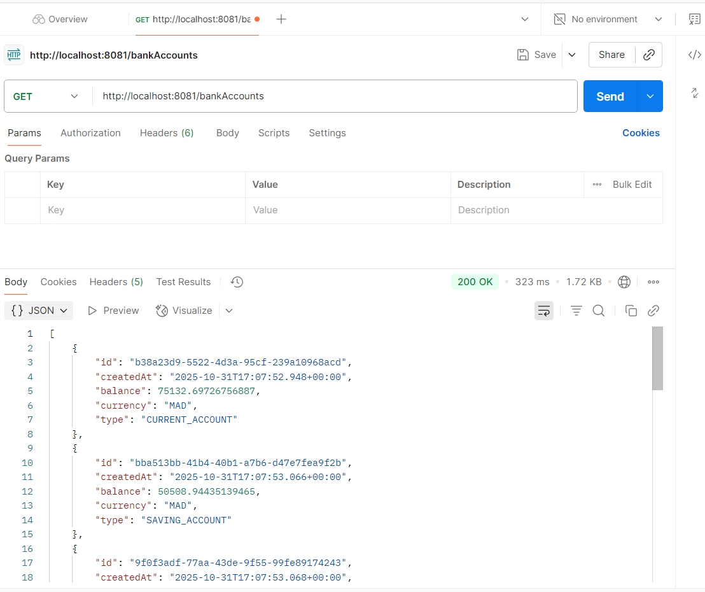

On peut aussi récupérer un compte bancaire en entrant son id dans l'url comme suit :

  ```
  http://localhost:8081/bankAccounts/{id}
  ```

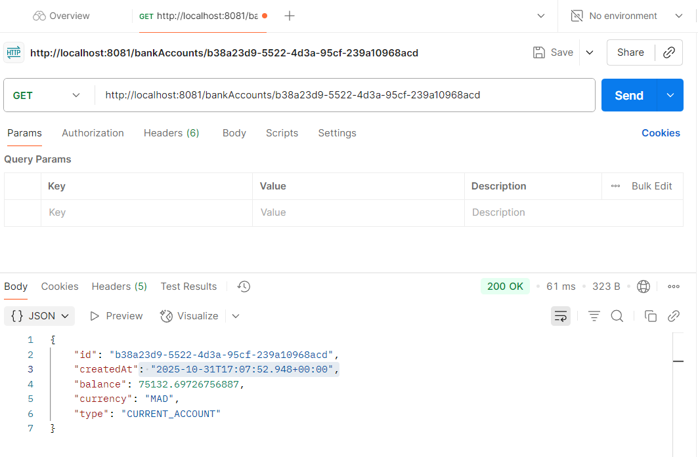

* **POST** → Pour créer un nouveau compte, nous avons utilisé la même URL :

  ```
  http://localhost:8081/bankAccounts
  ```

  En ajoutant dans les en-têtes (**Headers**) :

  ```
  Content-Type: application/json
  ```

  et en envoyant dans le corps (**Body**) un contenu JSON brut (**raw JSON**) contenant les informations du compte à créer (balance, currency, type, etc.).

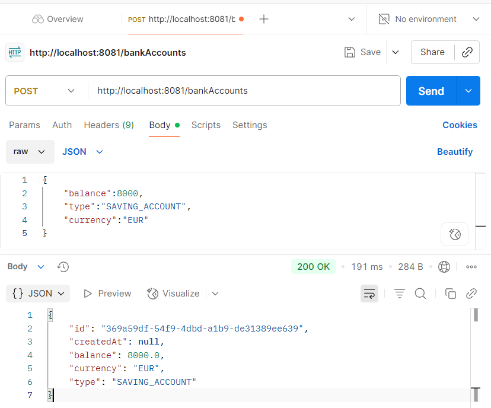

* **PUT** → Pour mettre à jour un compte existant, nous avons envoyé une requête vers :

  ```
  http://localhost:8081/bankAccounts/{id}
  ```

  où `{id}` correspond à l’identifiant du compte précédemment créé.
  Le corps de la requête contient un nouveau JSON modifié, permettant de changer certaines valeurs comme le solde ou la devise.

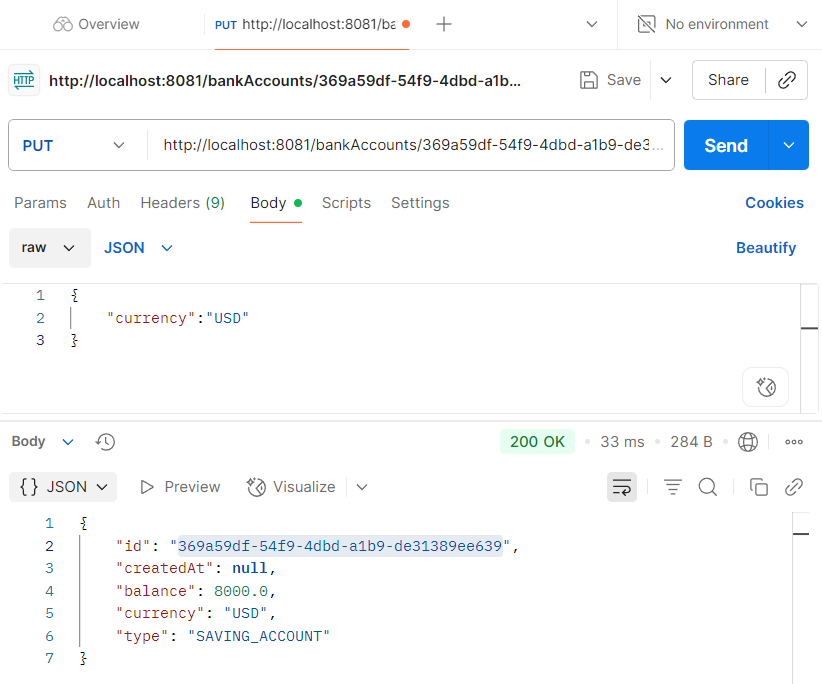

Ces tests ont permis de confirmer le bon comportement du microservice, la persistance des données dans la base H2 et la cohérence des réponses JSON retournées par l’API.

## VII. Générer et tester la documentation Swagger des API Rest du Web service

Afin de documenter et de tester facilement les différentes routes du microservice, nous avons intégré **Swagger** à notre projet à l’aide de la bibliothèque **Springdoc OpenAPI**.

Pour cela, nous avons ajouté la dépendance suivante dans le fichier `pom.xml`, récupérée depuis le dépôt officiel **Maven Repository** :

```xml
<!-- https://mvnrepository.com/artifact/org.springdoc/springdoc-openapi-ui -->
<dependency>
    <groupId>org.springdoc</groupId>
    <artifactId>springdoc-openapi-starter-webmvc-ui</artifactId>
    <version>2.6.0</version>
</dependency>
```

Une fois la dépendance installée, la documentation interactive est automatiquement générée et accessible via l’URL suivante :

```
http://localhost:8081/swagger-ui/index.html
```

Elle se présente comme suit :

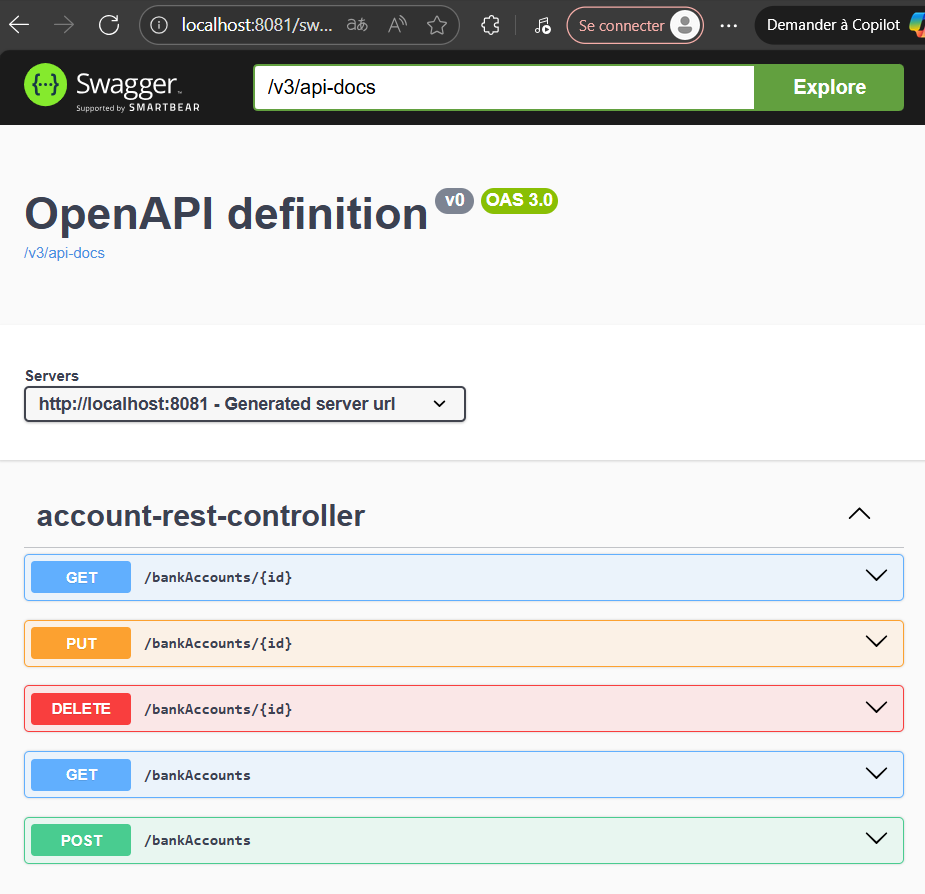

Depuis cette interface Swagger, nous avons pu **visualiser, tester et exécuter directement les requêtes HTTP** sur nos API REST — notamment les méthodes :

* **GET** → récupération de tous les comptes :

  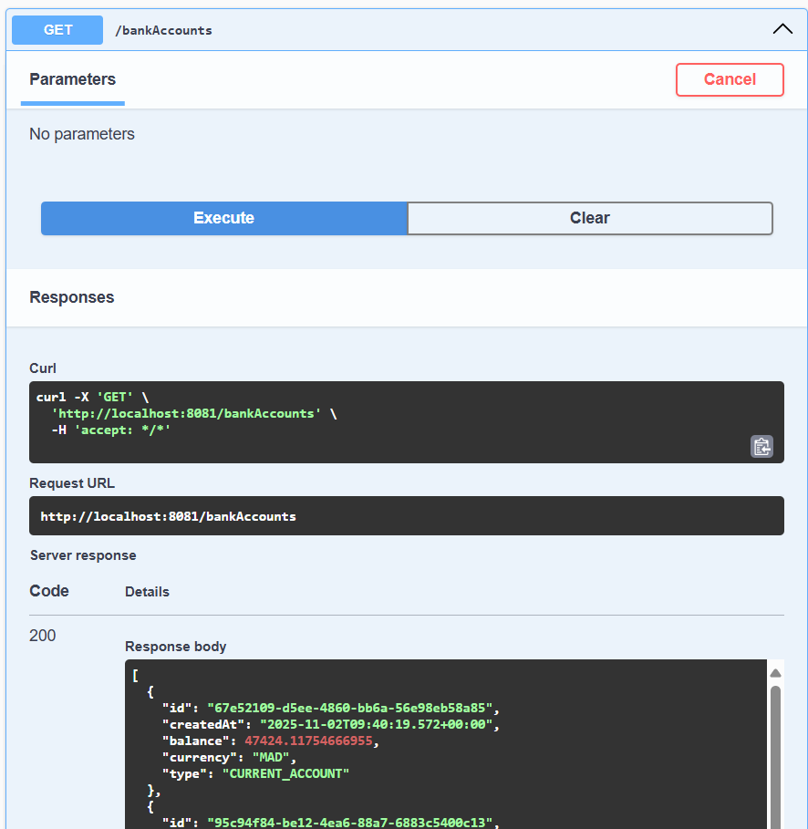

* **POST** → création d’un nouveau compte :

  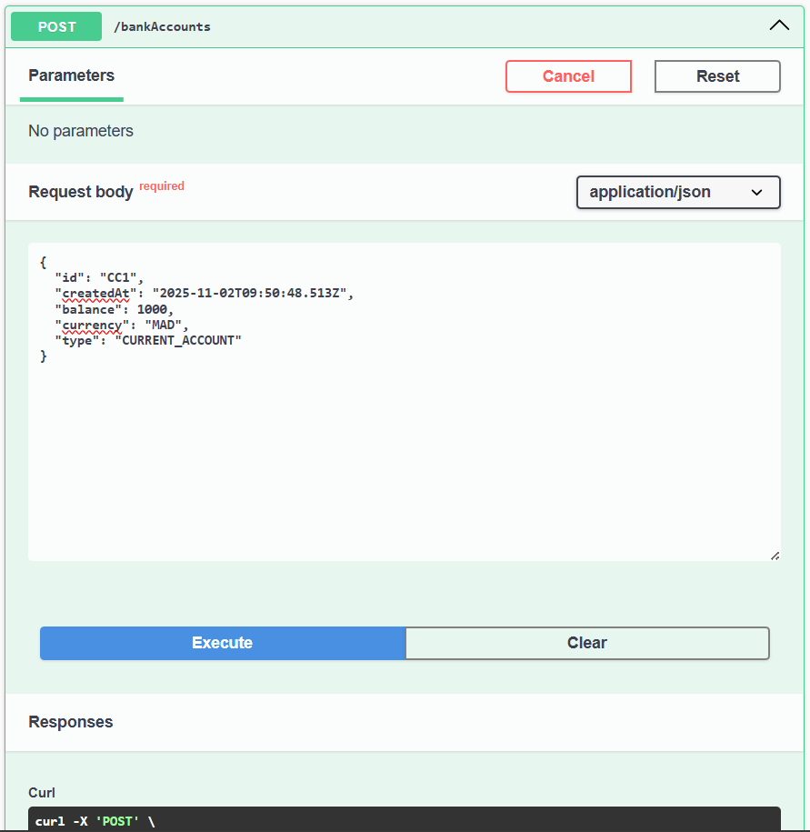

* **GET /{id}** → consultation d’un compte précis :
  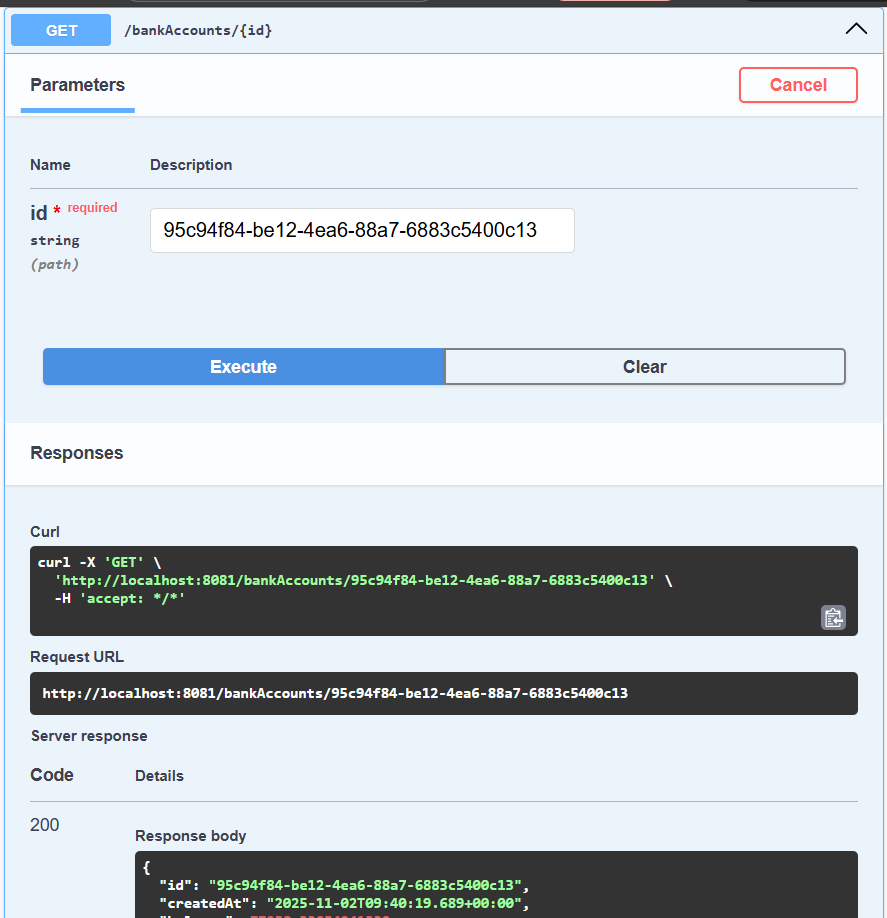

Swagger fournit également une **spécification OpenAPI** au format JSON accessible via :

```
http://localhost:8081/v3/api-docs
```

Ce lien a été **importé dans Postman**, ce qui a permis de générer automatiquement tous les endpoints du microservice et de les tester plus rapidement à partir de l’environnement Postman.

Exemple de test avec la méthode GET :
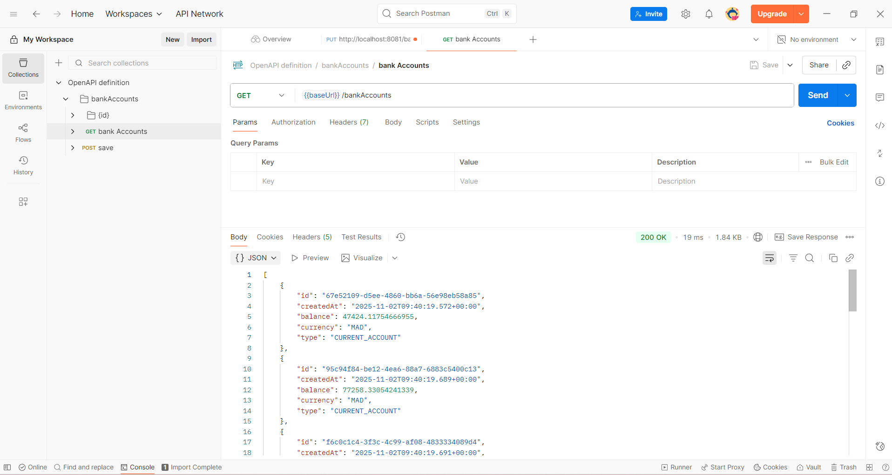

Cette étape a ainsi facilité la **validation, la documentation et la maintenance** du Web Service REST, tout en offrant une interface claire pour les futurs développeurs et testeurs.

## VIII. Exposer une API Restful en utilisant Spring Data Rest en exploitant des projections 

## IX. Créer les DTOs et Mappers

## X. Créer la couche Service (métier) et du micro service

## XI. Créer un Web service GraphQL pour ce Micro-service

---

## Conclusion

---

## Réalisé par :
- **Nom :** Wendbénédo Albéric Darius KONSEBO
- **Module :** Systèmes Distribués et Parallèles
- **Encadré par :** Pr. Mohamed YOUSSFI
- **Année académique :** 2025 - 2026